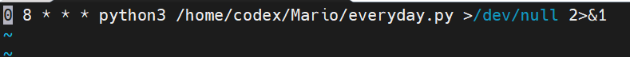
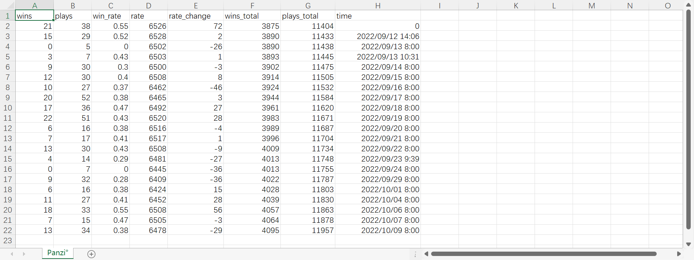

# English version
## Super Mario Maker 2 Winning Statistics Tutorial
Count the number of wins and totals per day, run and record them daily.

### Method
Add your own player ID to the user_ids array.  

### How to run
I am putting it on the Raspberry Pi with the crontab command to run the everyday.py file automatically every day at 8:00. The crontab command is as follows, please change the file address.  

### Result
The first run will record the current information, each run will record win rate data from the previous day to the current point in time.

# 中文
## 马造胜率统计教程
统计每天的马造胜利数和总游玩数，并自动记录。

### 方法
user_ids数组中添加自己的马造游玩ID。  

### 运行
我是放在树莓派上用crontab命令每天8点自动运行everyday.py文件，计算上一天的胜利数，游玩总数，胜率，分数变动和时间等参数，crontab的命令如下，请修改文件地址。  

### 结果
第一次运行只会记录当前的信息，无法获得前一天胜率。
每运行一次就会记录上一天到当前时间点的胜率数据。
如果成功运行并记录，最后的结果如下图所示，这是我最近一段时间的游玩记录：  

