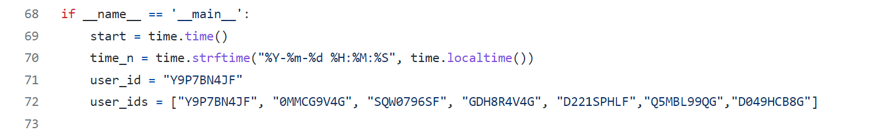

## 马造胜率统计教程
统计每天的马造胜利数和总游玩数，并自动记录。

### 方法
user_ids数组中添加自己的马造游玩ID。  

### 运行
我是放在树莓派上用crontab命令每天8点自动运行，计算上一天的胜利数，游玩总数，胜率，分数变动和时间等参数，crontab的命令如下，请修改文件地址。  

### 结果
如果成功运行并记录，最后的结果如下图所示，这是我最近一段时间的游玩记录：  

